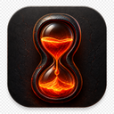
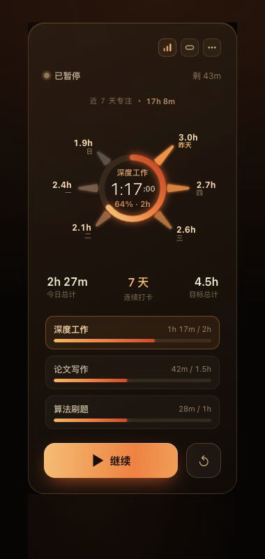
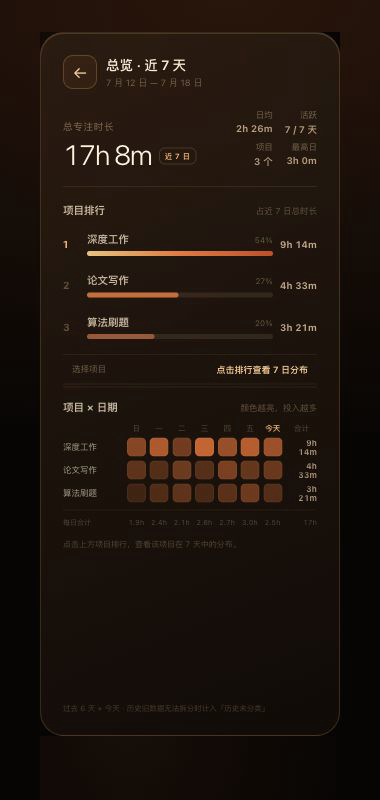

<p align="center">
  
</p>

<h1 align="center">LavaTimer</h1>

<p align="center">
  简体中文 · <a href="README.en.md">English</a>
</p>

<p align="center">
  一枚安静驻留桌面的多项目专注计时器。<br>
  轻量开始，清楚推进，回头看见时间去了哪里。
</p>

<p align="center">
  <a href="https://github.com/10tenet10/lava-timer/releases/latest"><strong>下载最新版</strong></a>
  ·
  <a href="#本地开发">本地开发</a>
  ·
  <a href="LICENSE">MIT License</a>
</p>

<p align="center">
  
  
  
  
</p>

> **项目状态：功能完整，进入维护模式。** 后续以缺陷修复和兼容性维护为主，不再扩张产品范围。

## 三种形态

LavaTimer 会随需要的信息密度自然收放：留在桌面一角、展开查看今天的进度，或回顾过去七天的投入。

### 胶囊态 · 不打断当前工作

只留下项目、时间、进度和开始按钮。

<p align="center">
  
</p>

### 专注面板 · 看清今天的推进

当前项目、每日目标、七日趋势和项目进度集中在可拖动的透明面板里。

<p align="center">
  
</p>

### 历史总览 · 看见时间的去向

在 7 天、30 天和全部记录之间切换，通过趋势、项目排行和日期热力图回顾投入；点击项目即可聚焦它的时间分布。

<p align="center">
  
</p>

## 功能

- 多项目独立计时与每日目标
- 完整面板、紧凑胶囊和 7 天 / 30 天 / 全部历史总览
- 菜单栏显示当前计时，点击显示或隐藏窗口
- 桌面悬浮、屏幕边缘吸附和自动选择展开方向
- macOS 锁屏、休眠、熄屏或屏幕保护启动时自动暂停
- 本地保存计时状态与历史记录，无需账户或网络
- 异常退出后只结算到最后一次存活记录，重新打开时保持暂停

## 安装

1. 从 [Releases](https://github.com/10tenet10/lava-timer/releases/latest) 下载最新的 `.dmg`。
2. 打开镜像，将 LavaTimer 拖入“应用程序”。
3. 从“应用程序”启动；LavaTimer 会驻留在菜单栏。

当前预构建版本面向 **Apple Silicon（M1 或更新芯片）**，最低支持 macOS 11。发布包使用 ad-hoc 签名，尚未经过 Apple notarization；首次打开时可能需要前往“系统设置 → 隐私与安全性”确认运行。

## 使用方式

1. 在设置中创建项目并设定每日目标。
2. 从胶囊或完整面板开始计时；计时中切换项目会自动结算旧项目。
3. 在历史总览中切换时间范围，查看项目投入、趋势和连续打卡情况。

关闭悬浮窗口只会隐藏它，计时仍在菜单栏继续。完全退出应用或异常退出后，再次打开会恢复为暂停状态，不会把离线时间计入专注。

## 数据与隐私

项目设置、每日计时和历史记录保存在应用 WebView 的本地存储中。LavaTimer 不创建账户、不上传记录，也不提供云同步或自动备份。

卸载应用或清除 WebView 数据会删除记录，请在操作前确认不再需要这些数据。

## 本地开发

需要 Node.js 22+、Rust stable 和 macOS Xcode Command Line Tools。

```bash
npm install
npm run dev
```

运行全部测试：

```bash
npm run check
```

构建 `.app` 与 `.dmg`：

```bash
npm run build
```

构建产物位于 `src-tauri/target/release/bundle/`。

## 技术栈

- [Tauri 2](https://v2.tauri.app/)
- Rust
- Vanilla HTML、CSS 与 JavaScript

## License

[MIT](LICENSE) © 2026 10tenet10
